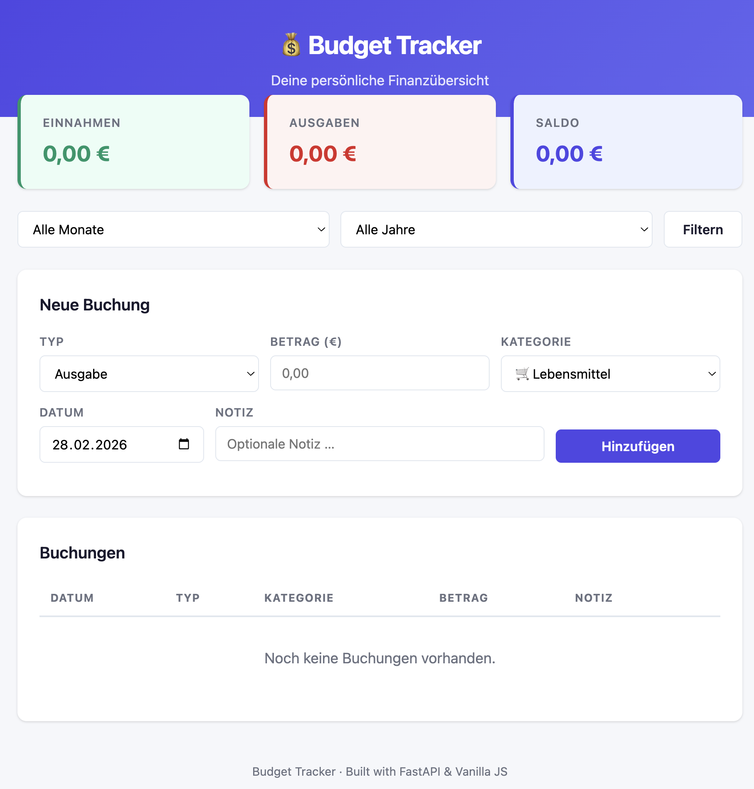

<p align="center">
  
</p>

<h1 align="center">💰 Budget Tracker</h1>

<p align="center">
  <strong>A clean, fullstack personal finance tracker built with Python &amp; vanilla JavaScript.</strong>
</p>

<p align="center">
  
  
  
  
  
</p>

---

## 📋 About

Budget Tracker is a lightweight web application for tracking personal income and expenses. It features a REST API built with **FastAPI**, a **SQLite** database for persistence, and a responsive frontend using plain **HTML, CSS & JavaScript** — no frameworks required.

This project was built as a portfolio showcase to demonstrate fullstack development skills including API design, database modelling, and clean frontend integration.

### ✨ Key Features

- **Record transactions** — Log income and expenses with amount, category, date, and optional notes
- **Financial overview** — See total income, expenses, and current balance at a glance
- **Filter & browse** — Filter transactions by month, year, type, or category
- **Category breakdown** — Summary endpoint with spending per category
- **Interactive API docs** — Auto-generated Swagger UI & ReDoc documentation
- **Responsive design** — Works on desktop and mobile devices

---

## 🖼️ Screenshots

<p align="center">
  
</p>

<p align="center">
  <em>Dashboard with summary cards and transaction list</em>
</p>

<details>
<summary>📸 More screenshots</summary>

| Swagger API Docs | Mobile View |
|:-:|:-:|
|  |  |

</details>

---

## 🏗️ Project Structure

```
budget-tracker/
├── backend/
│   ├── main.py            # FastAPI app, routes & middleware
│   ├── models.py          # SQLAlchemy ORM models
│   ├── database.py        # DB engine & session management
│   └── schemas.py         # Pydantic request/response schemas
├── frontend/
│   ├── index.html         # Single-page UI
│   ├── style.css          # Custom stylesheet
│   └── app.js             # Vanilla JS API client
├── data/                  # SQLite database (auto-created)
├── docs/
│   └── API.md             # Detailed API reference
├── screenshots/           # App screenshots for README
├── .gitignore
├── LICENSE
├── README.md
└── requirements.txt
```

---

## 🚀 Getting Started

### Prerequisites

- **Python 3.10+** — [Download](https://www.python.org/downloads/)
- **pip** — Included with Python
- **Git** — [Download](https://git-scm.com/)

### Installation

```bash
# 1. Clone the repository
git clone https://github.com/<WhileTrueBlackObelizk>/budget-tracker.git
cd budget-tracker

# 2. Create a virtual environment (recommended)
python -m venv venv
source venv/bin/activate        # macOS / Linux
venv\Scripts\activate           # Windows

# 3. Install dependencies
pip install -r requirements.txt

# 4. Start the server
uvicorn backend.main:app --reload

# 5. Open in your browser
#    → http://127.0.0.1:8000
```

The SQLite database (`data/budget.db`) is created automatically on first startup.

### Quick Test with cURL

```bash
# Create a transaction
curl -X POST http://127.0.0.1:8000/transactions \
  -H "Content-Type: application/json" \
  -d '{"amount": 42.50, "category": "Lebensmittel", "type": "expense", "note": "Wocheneinkauf"}'

# Get all transactions
curl http://127.0.0.1:8000/transactions

# Get summary
curl http://127.0.0.1:8000/summary
```

---

## 📡 API Reference

Base URL: `http://127.0.0.1:8000`

| Method   | Endpoint                  | Description                |
|----------|---------------------------|----------------------------|
| `GET`    | `/transactions`           | List all transactions      |
| `POST`   | `/transactions`           | Create a new transaction   |
| `GET`    | `/transactions/{id}`      | Get a single transaction   |
| `PUT`    | `/transactions/{id}`      | Update a transaction       |
| `DELETE` | `/transactions/{id}`      | Delete a transaction       |
| `GET`    | `/summary`                | Financial summary & stats  |

**Query Parameters** (for `GET /transactions` and `GET /summary`):

| Parameter  | Type   | Description                  |
|------------|--------|------------------------------|
| `category` | string | Filter by category name      |
| `type`     | string | `income` or `expense`        |
| `month`    | int    | Month number (1–12)          |
| `year`     | int    | Year (e.g. 2025)             |

> 📖 Full API documentation is also available at `/docs` (Swagger UI) and `/redoc` when the server is running.
>
> See [docs/API.md](docs/API.md) for detailed request/response examples.

---

## 🛠️ Tech Stack

| Layer     | Technology                         |
|-----------|------------------------------------|
| Backend   | Python 3.10+ · FastAPI · Uvicorn   |
| Database  | SQLite · SQLAlchemy ORM            |
| Frontend  | HTML5 · CSS3 · Vanilla JavaScript  |
| Docs      | Swagger UI · ReDoc (auto-generated)|

---

## 🗺️ Roadmap

- [x] CRUD API for transactions
- [x] Financial summary endpoint
- [x] Responsive frontend with filtering
- [ ] Charts & visualisation (Chart.js)
- [ ] Data export (CSV / PDF)
- [ ] User authentication
- [ ] Docker support
- [ ] Deployment guide (Railway / Render)

---

## 🤝 Contributing

Contributions are welcome! Please see [CONTRIBUTING.md](CONTRIBUTING.md) for guidelines.

---

## 📄 License

This project is licensed under the **MIT License** — see the [LICENSE](LICENSE) file for details.

---

<p align="center">
  Made with ☕ and Python
</p>
